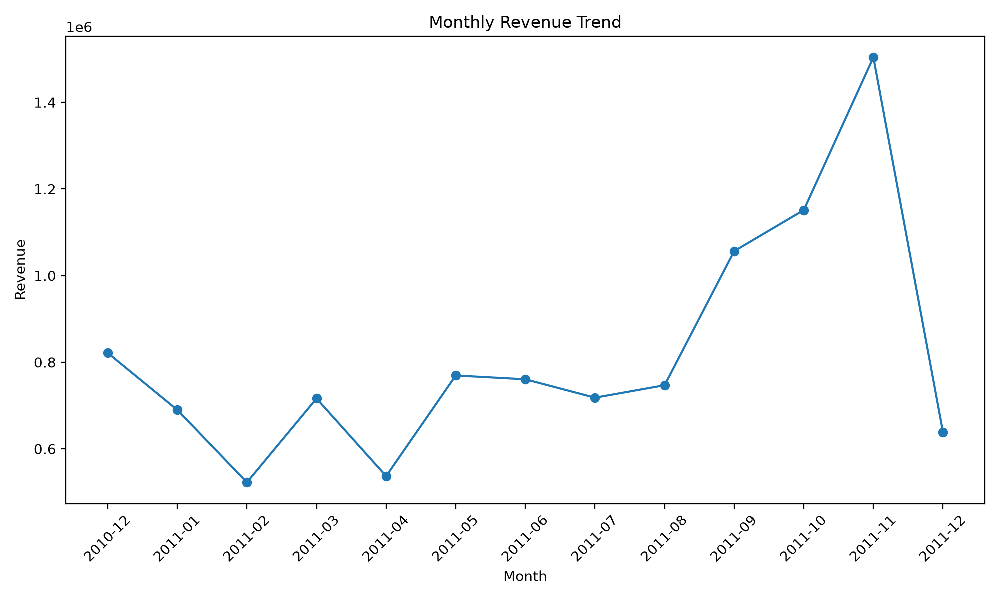
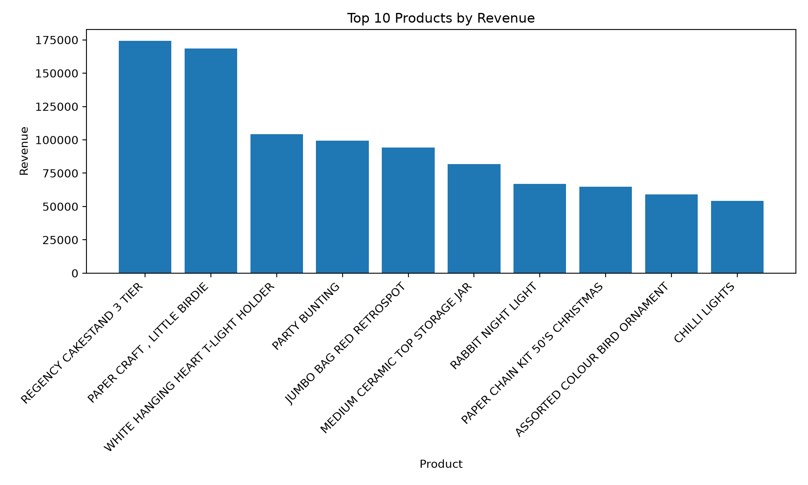
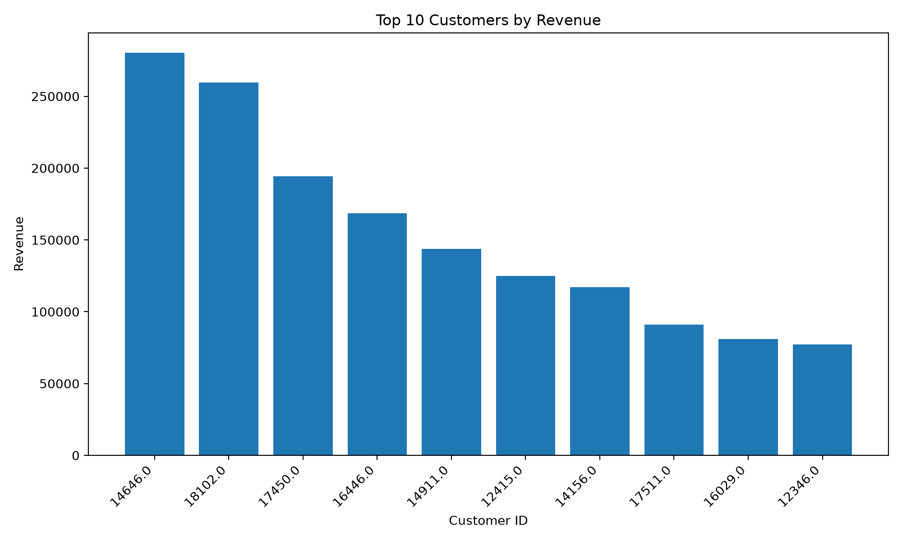
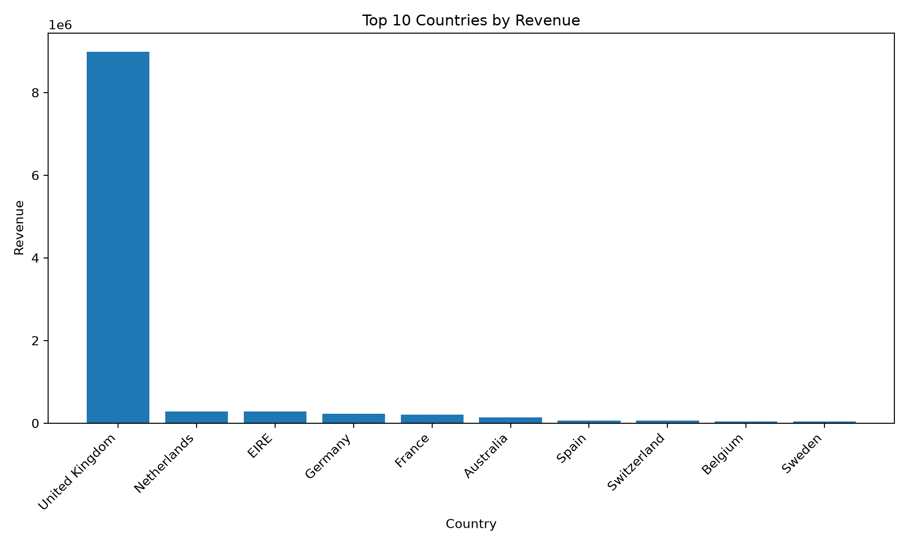
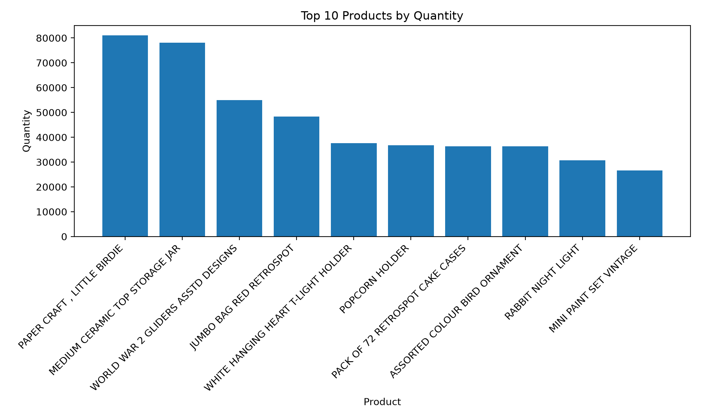

# Online Retail Data Analysis

A portfolio-focused retail sales analysis project built with **Python, pandas, and Matplotlib**.

This project cleans and prepares transactional retail data, creates a dedicated analysis dataset, and identifies key revenue and quantity patterns across **countries, products, customers, and time**.

---

## Business Objective

The objective of this project is to understand the main drivers of retail revenue and identify how sales performance varies across:

* Countries
* Products
* Customers
* Months

The analysis focuses on extracting practical business insights while keeping the workflow **transparent, reproducible, and easy to review**.

---

## Dataset

The project uses the **Online Retail** transactional dataset.

The raw dataset contains information including:

* Invoice number
* Stock code
* Product description
* Quantity
* Unit price
* Invoice date
* Customer ID
* Country

The workflow produces two datasets:

1. **Cleaned dataset** — prepared after applying the core data-cleaning rules.
2. **Analysis dataset** — further filtered to remove invalid or non-relevant description records.

> **Note:** The raw Excel dataset and generated CSV files are not included in this public repository because of their file size. The analysis can be reproduced locally using the original dataset.

---

## Data Cleaning

The cleaning workflow includes:

* Removing records with negative quantities
* Removing records with negative unit prices
* Removing duplicate rows
* Handling missing product descriptions
* Converting numeric and date columns to appropriate data types
* Creating a `TotalAmount` feature

```text
TotalAmount = Quantity × UnitPrice
```

Additional analysis-specific filtering includes:

* Excluding adjustment, wrong, damaged, bad debt, and coded description patterns
* Retaining missing `CustomerID` values in the general analysis dataset
* Using only records with available `CustomerID` for customer-level analysis

---

## Analysis Performed

The project analyzes retail performance across multiple dimensions:

* Country-level revenue
* Product-level revenue
* Product-level quantity
* Customer-level revenue
* Monthly revenue trends
* Month-over-month revenue growth
* Best revenue month
* Best month-over-month growth

---

## Key Business Insights

| Metric                  |                     Result |
| ----------------------- | -------------------------: |
| Clean Dataset Rows      |                    526,052 |
| Analysis Dataset Rows   |                    526,023 |
| Top Country by Revenue  |             United Kingdom |
| UK Revenue              |               8,990,682.03 |
| Top Product by Revenue  |   REGENCY CAKESTAND 3 TIER |
| Top Product Revenue     |                 174,156.54 |
| Top Product by Quantity | PAPER CRAFT, LITTLE BIRDIE |
| Top Product Quantity    |               80,995 units |
| Top Customer by Revenue |             Customer 14646 |
| Top Customer Revenue    |                 280,206.02 |
| Best Revenue Month      |              November 2011 |
| November 2011 Revenue   |               1,503,866.78 |
| Best MoM Growth         |                   May 2011 |
| May 2011 MoM Growth     |                     43.27% |

### Key Takeaways

* The **United Kingdom** is the strongest revenue-generating market in the dataset.
* A relatively small number of products contribute significantly to overall revenue.
* **REGENCY CAKESTAND 3 TIER** is the top product by revenue.
* **PAPER CRAFT, LITTLE BIRDIE** has the highest recorded quantity sold.
* Customer-level analysis shows significant revenue concentration among high-value customers.
* **November 2011** generated the highest monthly revenue.
* **May 2011** recorded the strongest month-over-month growth.

---

## Visualizations

### Monthly Revenue Trend



### Top 10 Products by Revenue



### Top 10 Countries by Revenue



### Top 10 Customers by Revenue



### Top 10 Products by Quantity



---

## Technologies Used

* **Python** — core programming language
* **pandas** — data cleaning, transformation, and analysis
* **Matplotlib** — data visualization
* **openpyxl** — reading the Excel dataset
* **pathlib** — file and directory management

---

## Project Structure

```text
online-retail-data-analysis/
│
├── README.md
├── online_retail_analysis_clean.py
├── .gitignore
│
└── charts/
    ├── monthly_revenue_trend.png
    ├── top_10_products_by_revenue.png
    ├── top_10_countries_by_revenue.png
    ├── top_10_customers_by_revenue.png
    └── top_10_products_by_quantity.png
```

### Local Project Files

When running the project locally, the following files/folders are generated:

```text
online-retail-data-analysis/
│
├── Online Retail.xlsx
├── data/
│   ├── online_retail_clean.csv
│   └── online_retail_analysis.csv
└── charts/
```

---

## How to Run Locally

### 1. Clone the repository

```bash
git clone https://github.com/shorifulislamovi8-oss/online-retail-data-analysis.git
```

### 2. Navigate to the project directory

```bash
cd online-retail-data-analysis
```

### 3. Install dependencies

```bash
pip install pandas matplotlib openpyxl
```

### 4. Add the dataset

Place the original `Online Retail.xlsx` file in the project root directory.

### 5. Run the analysis

```bash
python online_retail_analysis_clean.py
```

The script will:

* Create the required `data/` and `charts/` directories
* Generate the cleaned dataset
* Generate the analysis dataset
* Create the five visualizations
* Print the analysis summary in the terminal

---

## Future Improvements

Possible future extensions include:

* Product segmentation
* Repeat-customer analysis
* Customer retention analysis
* RFM analysis
* Advanced dashboarding
* Deeper country and seasonal analysis
* More detailed customer behavior analysis

---

## Summary

This project demonstrates a practical retail data-analysis workflow using Python.

It covers:

**Data Cleaning → Feature Engineering → Exploratory Analysis → Business Insights → Data Visualization**

The project demonstrates practical skills in **pandas, data cleaning, business analysis, feature engineering, and data visualization** using a real-world transactional retail dataset.
